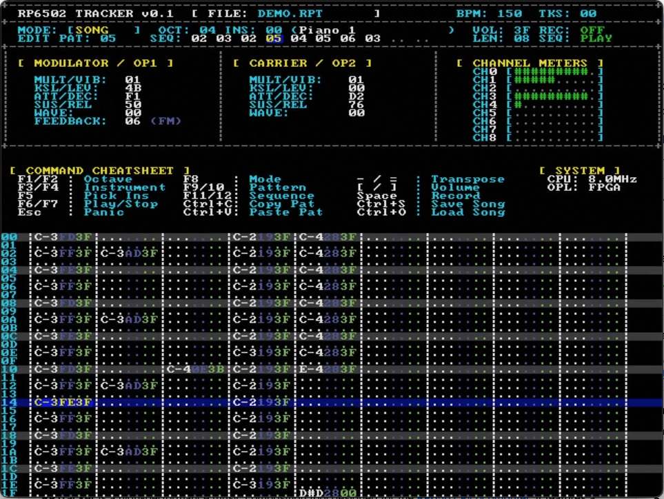

# RPTracker (v0.4)
### A Native 6502 Music Tracker for the RP6502 (Picocomputer)

**RPTracker** is a music composition tool designed for the [RP6502 Picocomputer](https://github.com/picocomputer). It features a 640x480 VGA interface and targets both the **Native RIA OPL2** emulation and the **FPGA OPL2** sound card. It provides a classic "tracker" workflow with modern high-resolution visual feedback.



---

## 🎹 Keyboard Control Reference

### 1. Musical Keyboard (Piano Layout)
RPTracker uses a standard "FastTracker II" style layout mapping:
*   **Lower Octave (C-3 to B-3):** `Z S X D C V G B H N J M`
*   **Upper Octave (C-4 to B-4):** `Q 2 W 3 E R 5 T 6 Y 7 U`

### 2. Global "Brush" Controls
These keys adjust the settings used when recording **new** notes.
*   **F1 / F2**: Decrease / Increase global keyboard **Octave**.
*   **F3 / F4**: Previous / Next **Instrument** (Wraps 00-FF).
*   **[ / ]**: Decrease / Increase global **Volume** (Range 00-3F).
*   **F5**: **Instrument Pick.** Samples the Note, Instrument, and Volume from the grid into your current Brush.

### 3. Transport & Navigation
*   **Arrow Keys**: Navigate the 9-channel pattern grid.
*   **ENTER**: **Play / Pause.** Starts playback from the current cursor position.
*   **SHIFT + ENTER**: **Stop & Reset.** Resets playback to the start of the pattern/song and silences all voices.
*   **F6**: **Toggle Follow Mode.** 
    *   *ON (Green):* Grid follows the playhead.
    *   *OFF (Red):* Grid stays put while music plays in the background.
*   **ESC**: **Emergency Panic.** Immediate silence on all channels.

### 4. Editing & Grid Commands
*   **Spacebar**: Toggle **Edit Mode**.
    *   *Blue Cursor:* Navigation only. Piano keys play sounds for preview.
    *   *Red Cursor:* Record Mode. Piano keys enter data and auto-advance.
*   **Backspace / Delete**: Clear the current cell (wipes Note, Ins, Vol, and Effect).
*   **Grave ( ` )**: Insert **Note Off** (`===`) and **Kill Effect** (`F000`).
*   **- / =**: **Transpose** the note in the current cell by **1 semitone**.
*   **SHIFT + - / =**: **Transpose** the current cell by **12 semitones (1 Octave)**.
*   **ALT + - / =**: **Transpose Column.** Transposes the entire channel in the current pattern.
*   **SHIFT + F3 / F4**: Change the **Instrument** of the current cell only.
*   **SHIFT + [ / ]**: Adjust the **Volume** of the current cell only.

### 5. Pattern & Sequence Management
*   **F9 / F10**: Jump to Previous / Next **Pattern ID** (The pattern currently on screen).
*   **F11 / F12**: Jump to Previous / Next **Sequence Slot** (Playlist position).
*   **SHIFT + F11 / F12**: Change the **Pattern ID** assigned to the current Sequence Slot.
*   **ALT + F11 / F12**: Decrease / Increase total **Song Length**.

### 6. Clipboard & Files
*   **Ctrl + C**: **Copy** the current 32-row pattern to the internal RAM clipboard.
*   **Ctrl + V**: **Paste** the clipboard into the current pattern (overwrites existing data).
*   **Ctrl + S**: **Save Song.** Opens a dialog to save the song to USB as an `.RPT` (v2) file.
*   **Ctrl + O**: **Load Song.** Opens a dialog to load an `.RPT` file from USB.

---

## 🛠 Effect Mode (Toggle with '/')

When in Effect Mode, the Instrument and Volume columns are replaced by a **4-digit Hex Effect** (`CSDT`). Each digit is edited independently to prevent value carry-over.

*   **SHIFT + [ / ]** : Change **Command** (Digit 1 - `X000`)
*   **[ / ]**       : Change **Style**   (Digit 2 - `0X00`)
*   **SHIFT + ' / ;**: Change **Param Hi** (Digit 3 - `00X0`)
*   **' / ;**       : Change **Param Lo** (Digit 4 - `000X`)

### 🎹 Effect Command 1: Advanced Arpeggio (1SDT)
The Arpeggio engine retriggers the note on every cycle step to ensure a crisp, high-speed attack.

**Format: `1 S D T`**

*   **1**: Command ID (Arpeggio).
*   **S (Style)**: The movement pattern (16 styles available):
    
    **Basic 2-Note Patterns:**
    *   `0`: **UP** - Root, +Depth (classic oscillation)
    *   `1`: **DOWN** - +Depth, Root (inverted oscillation)
    
    **Major/Minor Triads (4-Note with Octave):**
    *   `2`: **MAJOR** - Root, +4, +7, +12 - *Ignores D*
    *   `3`: **MINOR** - Root, +3, +7, +12 - *Ignores D*
    *   `6`: **SUS4** - Root, +5, +7, +12 - *Ignores D*
    *   `7`: **SUS2** - Root, +2, +7, +12 - *Ignores D*
    *   `9`: **AUG**  - Root, +4, +8, +12 - *Ignores D*
    
    **7th & Specialized Chords (4-Note):**
    *   `4`: **MAJ7**  - Root, +4, +7, +11 - *Ignores D*
    *   `5`: **MIN7**  - Root, +3, +7, +10 - *Ignores D*
    *   `8`: **DIM**   - Root, +3, +6, +9  - *Ignores D*
    *   `A`: **POWER** - Root, +7, +12, +12 - *Ignores D*

    **Guitar Strums (6-Note Open-Voiced Cycles):**
    *   `C`: **GTR MAJOR** - Emulates open G-Major (0, 4, 7, 12, 16, 19)
    *   `D`: **GTR MINOR** - Emulates open G-Minor (0, 3, 7, 12, 15, 19)
    *   `E`: **GTR MAJ9**  - Lush open Major 9th (0, 0, 4, 7, 11, 14)

    **Special Effects:**
    *   `B`: **UPDOWN** - Root, +Depth, +Depth, Root (bounce pattern)
    *   `F`: **DOUBLE** - Root, Root, +Depth, +Depth (stutter effect)

*   **D (Depth)**: The interval in semitones (0-F). Used by styles 0, 1, B, F. Ignored by preset chord patterns.
*   **T (Timing)**: The cycle speed (mapped to a Musical LUT):
    *   `0-2`: High-speed "Buzz" (1-3 VSync frames)
    *   `3`: **1 Row** (6 ticks) - Standard rhythmic speed
    *   `7`: **2 Rows** (12 ticks)
    *   `B`: **4 Rows** (24 ticks - 1 Beat)
    *   `F`: **16 Rows** (96 ticks - 1 Bar)

**Usage Examples:**
- `1203`: Standard Major chord arpeggio, 1 row per note.
- `1C01`: Fast Guitar Major strum (creates a "shimmering" chord effect).
- `1E02`: Open-voiced Major 9th "jazz" strum at medium-high speed.
- `10C3`: Simple octave oscillation (Up 12 semitones, every 1 row).
- `F000` or `0000`: Stop all effects on the channel.

---

### 🎶 Effect Command 2: Portamento (2SDT)
Portamento creates pitch slides. In RPTracker, this effect steps through full semitones at a designated speed.

**Format: `2 S D T`**

*   **S (Mode)**:
    *   `0`: **Up (Infinite)** - Slides upward until the note ends or hits MIDI max.
    *   `1`: **Down (Infinite)** - Slides downward until the note ends or hits MIDI min.
    *   `2`: **Up (Relative)** - Slides upward by **T** semitones (0=Octave).
    *   `3`: **Down (Relative)** - Slides downward by **T** semitones (0=Octave).
*   **D (Speed)**: Ticks between each 1-semitone step (1=Fastest).
*   **T (Value)**:
    *   Modes 0/1: Ignored.
    *   Modes 2/3: Number of semitones to slide.

**Usage Examples:**
- `2212`: Slide up 2 semitones very quickly (1 tick per step).
- `2347`: Slide down a perfect 5th (7 semitones) at a medium pace.
- `2010`: Fast "Laser" rising sound effect.
- `F000` or `0000`: Stop portamento effect.

**Notes:**
- Portamento and Arpeggio are mutually exclusive - activating one disables the other.
- The effect automatically stops when reaching the target note.
- Combine with Note Off (`===`) for creative pitch drops.

---

### 🎚️ Effect Command 3: Volume Slide (3SDT)
Volume Slide uses 8.8 fixed-point math to create perfectly smooth fades.

**Format: `3 S D T`**

*   **3**: Command ID (Volume Slide).
*   **S (Mode)**: The slide direction:
    *   `0`: **UP** - Increases volume toward maximum or target
    *   `1`: **DOWN** - Decreases volume toward silence or target
    *   `2`: **TO TARGET** - Slides to the specific volume in T
    
*   **D (Speed)**: Volume units to change per tick (1-F):
    *   `1`: Very slow fade (1 unit per tick)
    *   `2-4`: Slow fade (smooth, musical)
    *   `5-8`: Medium fade (noticeable change)
    *   `9-C`: Fast fade (dramatic effect)
    *   `D-F`: Very fast fade (instant change)

*   **T (Target)**: The target volume or limit (0-F, scaled to 0-63):
    *   **Mode 0**: Target volume for fade-in (0 = fade to max volume 63)
    *   **Mode 1**: Target volume for fade-out (0 = fade to silence)
    *   **Mode 2**: Exact target volume (0=silent, F=max)

**Usage:**
- `3020`: Fade up to max volume, 2 units per tick (smooth crescendo).
- `3130`: Fade down to silence, 3 units per tick (smooth fade-out).
- `3048`: Fade up to medium volume (8/15 = ~34/63), 4 units per tick.
- `3218`: Fade to medium-low volume (8/15), 1 unit per tick (slow swell).
- `310F`: Fast fade to max, 1 unit per tick.
- `F000` or `0000`: Stop volume slide effect.

**Notes:**
- Volume slide works independently with arpeggio and portamento effects.
- The effect automatically stops when reaching the target volume.
- Perfect for dynamic expression, drum envelopes, and atmospheric pads.

---

### 🎸 Effect Command 4: Vibrato (4RDT)
Vibrato adds expressive pitch oscillation to sustained notes, creating warmth and character.
The effect continuously modulates pitch using different waveforms at adjustable rates and depths.

**Format: `4 R D T`**

*   **4**: Command ID (Vibrato).
*   **R (Rate)**: Oscillation speed - ticks per phase step (1-F):
    *   `1`: Very fast vibrato (rapid warble)
    *   `2-4`: Fast vibrato (noticeable oscillation)
    *   `5-8`: Medium vibrato (musical default)
    *   `9-C`: Slow vibrato (gentle wave)
    *   `D-F`: Very slow vibrato (subtle modulation)
    *   Lower values = faster oscillation
    
*   **D (Depth)**: Pitch deviation in semitones (1-F):
    *   `1-2`: Subtle vibrato (smooth, realistic)
    *   `3-5`: Medium vibrato (expressive, musical)
    *   `6-9`: Wide vibrato (dramatic)
    *   `A-F`: Very wide vibrato (extreme effect)

*   **T (Waveform)**: The oscillation shape:
    *   `0`: **SINE** - Smooth, natural vibrato (default)
    *   `1`: **TRIANGLE** - Linear rise/fall (vintage synth)
    *   `2`: **SQUARE** - Abrupt pitch jumps (trill effect)
    *   Other values wrap to 0-2

**Usage:**
- `4420`: Classic vibrato - medium rate, 2 semitones, sine wave (leads/vocals).
- `4230`: Fast subtle vibrato - quick rate, 3 semitones, sine (strings).
- `4651`: Wide slow vibrato - slow rate, 5 semitones, triangle (pads).
- `4322`: Medium vibrato with square wave for trill effect.
- `4A10`: Ultra-slow, subtle sine vibrato for atmospheric textures.
- `F000` or `0000`: Stop vibrato effect.

**Notes:**
- Vibrato and Arpeggio are mutually exclusive - activating one disables the other.
- Vibrato works independently with portamento and volume slide.
- Continuous effect - runs until explicitly stopped or note changes.
- Perfect for leads, pads, strings, and adding life to sustained notes.
- Combine with Note Off (`===`) for creative pitch drops.

---

### ✂️ Effect Command 5: Note Cut (5__T)
Note Cut silences a note after a specified number of ticks, creating staccato rhythms and percussive effects.
Perfect for drum programming, rhythmic patterns, and tight, punchy sequences.

**Format: `5 _ _ T`**

*   **5**: Command ID (Note Cut).
*   **T (Cut Time)**: Ticks before silencing (1-F):
    *   `1`: Cut after 1 tick (very short note)
    *   `2-3`: Cut after 2-3 ticks (staccato)
    *   `4-6`: Cut after 4-6 ticks (normal, 1 row = 6 ticks)
    *   `7-9`: Cut after 7-9 ticks (short sustain)
    *   `A-F`: Cut after 10-15 ticks (longer sustain)
    *   `0` defaults to 1 tick

**Usage:**
- `5003`: Cut note after 3 ticks (half a row) - tight hi-hat pattern.
- `5006`: Cut note after full row - standard staccato.
- `500C`: Cut after 2 rows (12 ticks) - medium sustain.
- `5001`: Extremely short note - percussive effect.

**Notes:**
- Works with all other effects.
- Perfect for drum patterns and rhythmic sequences.
- Combine with retrigger for stuttering effects.

---

### ⏱️ Effect Command 6: Automatic Feedback Echo (6VDT)
This effect creates a rhythmic, decaying series of echoes on the same channel. Unlike a standard delay, this engine triggers the original note immediately on the beat and then schedules "bounces" that fade away over time.

**Format: `1 V D T`** (where 6 is the command ID)

*   **V (Volume)**: The starting volume of the *first* echo (0-F). 
    *   Each subsequent bounce automatically decays (drops by ~25%) until the volume hits zero.
*   **D (Delay)**: The number of ticks between each bounce (1-F). 
    *   Lower values create a "buzz" or "slapback"; higher values create rhythmic "galloping" echoes.
*   **T (Transpose)**: Pitch offset for the echoes in semitones (0-F). 
    *   All bounces will be shifted by this amount relative to the original note.

**Usage Examples:**
- `6F40`: **Classic Echo.** The note repeats at full volume after 4 ticks and then slowly fades away while looping.
- `6C27`: **Harmonic Strum.** A Perfect 5th (+7 semitones) repeats every 2 ticks, sounding like a fast, cascading chord.
- `691C`: **Octave Thickener.** Adds a fast, quieter octave-up double (+12 semitones) every 1 tick for a "shimmer" effect.
- `6F10`: **Slapback.** A single fast, loud repeat that adds weight to percussion or leads.

**Notes:**
- **Persistence:** The echo continues to bounce across empty rows (`0000`) until the volume reaches zero.
- **Auto-Kill:** Entering a new note on the channel or using `F000` will immediately kill any active echo feedback.
- **Monophonic Nature:** Since the OPL2 is monophonic per channel, each echo bounce will cut off the tail of the previous bounce.

---

### 💡 Pro-Tip for Composers
Because the echoes retrigger the instrument, this effect works best with **Pluck** or **Percussive** patches (Piano, Glockenspiel, Guitar). If used with a long "Sustain" patch (like a Flute or Pad), the echo will sound like a rhythmic "re-bowing" of the note.

---

### 🔁 Effect Command 7: Retrigger (7__T)
Retrigger repeatedly restarts a note at regular intervals, creating stuttering, rolls, and rapid-fire effects.
Essential for drum rolls, glitchy effects, and rhythmic intensity.

**Format: `7 _ _ T`**

*   **7**: Command ID (Retrigger).
*   **T (Speed)**: Ticks between retriggers (0-F):
    *   `0`: Defaults to 3 ticks (2 retriggers per row)
    *   `1`: Every tick (6 retriggers per row) - machine gun
    *   `2`: Every 2 ticks (3 retriggers per row) - fast roll
    *   `3`: Every 3 ticks (2 retriggers per row) - standard roll
    *   `4-6`: Every 4-6 ticks (slower rolls)
    *   `7-C`: Every 7-12 ticks (rhythmic patterns)
    *   `D-F`: Very slow retriggers

**Usage:**
- `7003`: Standard snare roll (retrigger every 3 ticks).
- `7001`: Ultra-fast buzz effect (every tick).
- `7006`: Retrigger every row (rhythmic stutter).
- `700C`: Retrigger every 2 rows (slow repeat).

**Notes:**
- Retriggers start immediately and continue until stopped.
- Perfect for drum rolls, glitch effects, and rhythmic tension.
- Combine with volume slide for dynamic rolls.
- Works with all other effects.

---

### 📢 Effect Command 8: Tremolo (8RDT)
Tremolo adds volume oscillation to sustained notes, creating pulsing, rhythmic movement, and texture.
The volume counterpart to vibrato - essential for pads, rhythmic effects, and dynamic expression.

**Format: `8 R D T`**

*   **8**: Command ID (Tremolo).
*   **R (Rate)**: Oscillation speed - ticks per phase step (1-F):
    *   `1`: Very fast tremolo (rapid pulsing)
    *   `2-4`: Fast tremolo (noticeable rhythm)
    *   `5-8`: Medium tremolo (musical pulsing)
    *   `9-C`: Slow tremolo (gentle wave)
    *   `D-F`: Very slow tremolo (subtle movement)
    
*   **D (Depth)**: Volume deviation (1-F):
    *   `1-2`: Subtle tremolo (gentle pulsing)
    *   `3-5`: Medium tremolo (noticeable dynamics)
    *   `6-9`: Wide tremolo (dramatic pulsing)
    *   `A-F`: Very wide tremolo (extreme effect)
    *   `0`: Defaults to 4

*   **T (Waveform)**: The oscillation shape:
    *   `0`: **SINE** - Smooth, natural tremolo
    *   `1`: **TRIANGLE** - Linear rise/fall
    *   `2`: **SQUARE** - Abrupt volume jumps (gating effect)

**Usage:**
- `8440`: Classic tremolo - medium rate, 4 units depth, sine (pads/strings).
- `8230`: Fast subtle tremolo for rhythmic movement.
- `8652`: Wide slow tremolo with square wave (gating effect).
- `8320`: Medium tremolo for expressive pulsing.
- `8A10`: Ultra-slow subtle tremolo for texture.

**Notes:**
- Works independently with all other effects.
- Perfect for pads, organs, strings, and rhythmic textures.
- Combine with vibrato for complex modulation.
- Continuous effect until explicitly stopped.

---

### 🎛️ Effect Command 9: Fine Pitch (9__D)
Fine Pitch applies subtle pitch adjustments for microtuning, chorus effects, and detuning.
Adds richness and width to sounds without full semitone shifts.

**Format: `9 _ _ D`**

*   **9**: Command ID (Fine Pitch).
*   **D (Detune)**: Pitch adjustment in 1/16 semitone steps (0-F):
    *   `0-7`: Detune UP by 0-7 sixteenths of a semitone
    *   `8-F`: Detune DOWN by 8-1 sixteenths of a semitone
        *   `8` = -8/16 (half semitone down)
        *   `9` = -7/16
        *   `A` = -6/16
        *   ...
        *   `F` = -1/16 (very subtle down)

**Usage:**
- `9002`: Slight upward detune (chorus effect).
- `900E`: Slight downward detune (chorus effect on second channel).
- `9004`: Medium upward detune (layer with undetuned note for width).
- `9008`: Half semitone down (between notes).

**Notes:**
- Fine pitch is applied once on note trigger (not continuous).
- Perfect for chorus/ensemble effects using multiple channels.
- OPL2 has limited fine-tuning precision - effect is approximate.
- Combine detuned channels for thick, wide sounds.
- Works with all other effects.

---

### 🎲 Effect Command A: Stochastic Generator (ASDT)
Creates infinite, scale-locked random melodies. The engine picks a random note from a specific musical scale every T ticks.

**Format: `A S D T`**

*   **S (Scale)**: DNA of the melody:
    *   `0`: Chromatic (Chaos)
    *   `1`: Major
    *   `2`: Minor
    *   `3`: Major Pentatonic (Safe/Happy)
    *   `4`: Minor Pentatonic (Blues/Rock)
    *   `5`: Whole Tone (Dreamy)
*   **D (Depth)**: Range of the "wander" (1-F steps up the scale).
*   **T (Timing)**: How often to pick a new note (mapped to Musical LUT).

**Usage:**
- `A372`: Fast "computer glitch" sounds in Major Pentatonic (Range: 7 notes).
- `A4F7`: Slow, bluesy random background notes (Range: 2 octaves, Speed: 2 rows).

---

## 🎚️ Combining Effects

Effects in RPTracker can run simultaneously or sequentially, but some combinations have specific behaviors and limitations.

### ✅ Compatible Combinations (Run Simultaneously)

These effects work together and can create complex, layered sounds:

**Arpeggio + Volume Control:**
```
Row 00: C-3 00 3F 12C3  ← Major arpeggio starts
Row 04: ... .. .. 3130  ← Volume slide down (arpeggio keeps running)
Row 08: ... .. .. 0000  ← Empty row (both effects continue)
```

**Arpeggio + Tremolo:**
```
Row 00: C-3 00 3F 12C3  ← Major arpeggio
Row 01: ... .. .. 8440  ← Add tremolo (pitch + volume oscillation)
```

**Portamento + Volume Slide:**
```
Row 00: C-3 00 3F 2046  ← Slide up 4 semitones
Row 02: ... .. .. 3020  ← Fade in while sliding
```

**Vibrato + Tremolo:**
```
Row 00: C-3 00 3F 4420  ← Vibrato on note
Row 01: ... .. .. 8440  ← Add tremolo (rich modulation)
```

**Any Effect + Note Cut:**
```
Row 00: C-3 00 3F 12C3  ← Major arpeggio
Row 04: ... .. .. 5006  ← Cut after 6 ticks (stops arp cleanly)
```

### ❌ Mutually Exclusive Effects

These effects cannot run simultaneously - activating one disables the other:

**Arpeggio ⟷ Vibrato:**
```
Row 00: C-3 00 3F 12C3  ← Arpeggio starts
Row 04: ... .. .. 4420  ← Vibrato replaces arpeggio
```
- Both modulate pitch but use different techniques.
- Code explicitly disables arpeggio when starting vibrato and vice versa.

**Arpeggio ⟷ Portamento:**
```
Row 00: C-3 00 3F 12C3  ← Arpeggio starts
Row 04: ... .. .. 2046  ← Portamento replaces arpeggio
```
- Portamento kills arpeggio when activated.

### ⚠️ Effects That Retrigger Notes

These effects restart the note, interrupting any running pitch-based effects:

**Portamento** - Continuously retriggers as it steps through semitones
**Fine Pitch (9XXX)** - Immediately retriggers on parse
**Note Delay (6XXX)** - Retriggers when delay timer expires
**Retrigger (7XXX)** - Explicitly designed to retrigger repeatedly

**Example - Fine Pitch Interrupts Arpeggio:**
```
Row 00: C-3 00 3F 12C3  ← Major arpeggio starts
Row 04: ... .. .. 9002  ← Fine pitch retriggers note, stops arpeggio!
```

**Better Approach - Stop First:**
```
Row 00: C-3 00 3F 12C3  ← Major arpeggio
Row 04: ... .. .. F000  ← Stop all effects
Row 05: C-3 00 3F 9002  ← New note with fine pitch
```

### 🎵 Effect Persistence Rules

1. **Effects persist across empty rows** until explicitly changed or stopped.
2. **Use `F000` to stop all effects** on a channel.
3. **Use `0000` on empty rows** to indicate "no change" (effects continue).
4. **New note without effect** (`cmd == 0`) stops all effects except when specified.

**Example - Long-Running Effect:**
```
Row 00: C-3 00 3F 4420  ← Vibrato starts
Row 01: ... .. .. 0000  ← Empty (vibrato continues)
Row 02: ... .. .. 0000  ← Empty (vibrato continues)
Row 03: ... .. .. 0000  ← Empty (vibrato continues)
Row 04: ... .. .. F000  ← Stop vibrato
```

### 💡 Advanced Combinations

**Layered Modulation (Multiple Channels):**
```
Chan 0: C-3 00 3F 12C3  ← Major arpeggio
Chan 1: E-3 00 3F 9002  ← Detuned major third (chorus)
Chan 2: G-3 00 3F 900E  ← Detuned fifth (wide chord)
```

**Dynamic Arpeggio:**
```
Row 00: C-3 00 3F 12C3  ← Major arpeggio at full volume
Row 08: ... .. .. 3130  ← Fade out while arpeggating
Row 10: ... .. .. 5006  ← Cut cleanly
```

**Rhythmic Texture:**
```
Row 00: C-3 00 3F 7003  ← Retrigger every 3 ticks
Row 04: ... .. .. 8240  ← Add tremolo for pulsing rolls
```

**Delayed Harmony:**
```
Row 00: C-3 00 3F 0000  ← Base note
Row 00: ... .. .. 6743  ← Delay +7 semitones, 4 ticks (harmony echo)
```

---

## 🎼 Instrument Bank
RPTracker includes a 256-instrument GM-compatible OPL2 patch bank loaded from **gm_bank[]** in [instruments.c](src/instruments.c).
Each instrument is an **OPL_Patch** struct containing 11 registers that define the FM synthesis parameters.

### Using Instruments
*   **F3/F4**: Cycle through instruments (auto-exits effect view mode).
*   **F5**: Pick instrument from cell under cursor.
*   **SHIFT + F3/F4**: Change instrument of current cell only.
*   **Instrument Range**: 0x00-0xFF (256 patches).

### Key Instruments (Patches 0-15)
*   **00-03**: Piano variations (Acoustic, Bright, Electric)
*   **04**: Honky-tonk Piano
*   **05-07**: Electric Piano variations (Rhodes, Chorus, Harpsichord)
*   **08-11**: Chromatic Percussion (Celesta, Glockenspiel, Music Box, Vibraphone)
*   **12-15**: Organ variations (Drawbar, Percussive, Rock, Church)

### Notable Categories
*   **16-23**: Guitars (Acoustic, Electric, Distortion, Harmonics)
*   **24-31**: Bass (Acoustic, Finger, Pick, Fretless, Slap, Synth)
*   **32-39**: Strings (Violin, Viola, Cello, Tremolo, Pizzicato, Harp)
*   **40-47**: Ensemble (Strings, Brass, Synth)
*   **48-55**: Brass (Trumpet, Trombone, Tuba, Horn, Saxophone)
*   **56-63**: Reed (Clarinet, Oboe, Bassoon)
*   **64-71**: Pipe (Flute, Pan Flute, Ocarina, Whistle)
*   **72-79**: Synth Lead (Square, Saw, Calliope, Chiff, Charang, Voice, Fifths, Bass)
*   **80-87**: Synth Pad (New Age, Warm, Polysynth, Choir, Bowed, Metallic, Halo, Sweep)
*   **88-95**: Synth Effects (Rain, Soundtrack, Crystal, Atmosphere, Brightness, Goblins, Echoes, Sci-Fi)
*   **96-103**: Ethnic (Sitar, Banjo, Shamisen, Koto, Kalimba, Bagpipe, Fiddle, Shanai)
*   **104-111**: Percussion (Tinkle Bell, Agogo, Steel Drums, Woodblock, Taiko, Tom, Synth Drum, Reverse Cymbal)
*   **112-119**: Sound Effects (Fret Noise, Breath, Seashore, Birds, Telephone, Helicopter, Applause, Gunshot)

### Instrument Sustain Characteristics
For sustained effects (vibrato, tremolo, arpeggios), choose instruments with:
*   **Low Release Rate**: Bottom nibble of `susrel` register (0=slowest, F=fastest).
*   **Sustained Volume**: Low sustain level (top nibble of `susrel`, 0=loudest).

**Good Sustain Examples:**
*   Instrument 9, 10: Bell sounds with long decay
*   Instrument 3: Bright Piano (moderate sustain)
*   Most Pad instruments (80-87): Designed for sustained notes

**Poor Sustain Examples:**
*   Instrument 0: Acoustic Piano (medium release = quick decay)
*   Percussion instruments: Designed for short hits

### Customizing Instruments
Edit [instruments.c](src/instruments.c) to customize patches. Each **OPL_Patch** contains:
```c
typedef struct {
    uint8_t m_ave, m_ksl, m_atdec, m_susrel, m_wave;  // Modulator
    uint8_t c_ave, c_ksl, c_atdec, c_susrel, c_wave;  // Carrier
    uint8_t feedback;
} OPL_Patch;
```

Rebuild with `cmake --build build` after changes.

---

## 🖥 User Interface Guide

### The Dashboard (Top)
The top 27 rows provide a real-time view of the synthesizer and sequencer state:
*   **Status Bar:** Displays current Mode, Octave, Instrument name, Volume, and Sequencer status.
*   **Sequence Row:** A horizontal view of your song structure (e.g., `00 00 01 02`). The active slot is highlighted in **Yellow**.
*   **Operator Panels:** Shows the 11 raw OPL2 registers for the currently selected instrument (Modulator and Carrier).
*   **Channel Meters:** Visual bars that react to note volume and decay over time.
*   **System Panel:** Displays active hardware (Native OPL2 vs FPGA) and CPU speed.

### The Grid (Bottom)
The pattern grid starts at **Row 28**.
*   **Dark Grey Bars:** Highlights every 4th row (0, 4, 8, etc.) to indicate the musical beat.
*   **Syntax Highlighting:**
    *   **White:** Musical Notes.
    *   **Muted Purple:** Instrument IDs.
    *   **Sage Green:** Volume Levels.
    *   **Cyan:** Dividers and Row Numbers.

---
*Created by Jason Rowe. Developed for the RP6502 Picocomputer Project.*
